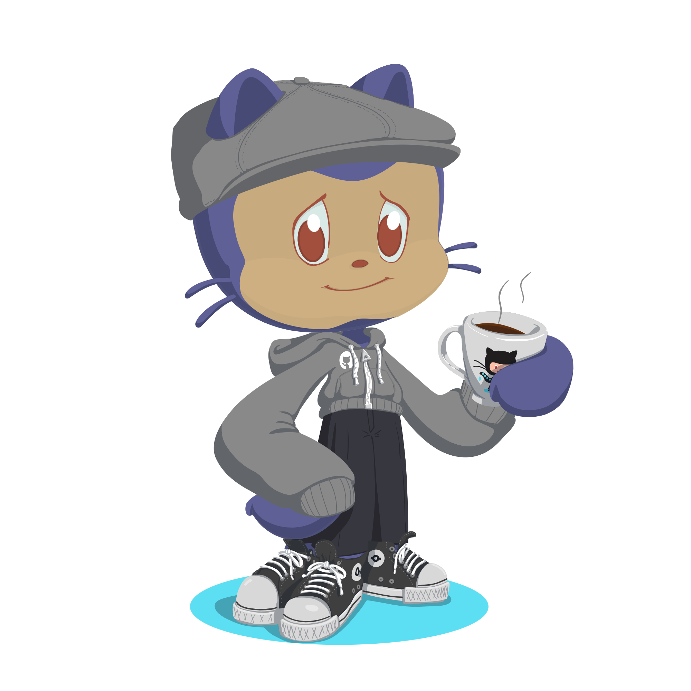

# Hi folks👋, Welcome!

Hello! My name is <i>Rian C. Quintanilha</i>. I'm from Federal University of Juiz de Fora taking BS Computer Science. 
I have interest in Cybersecurity and Machine Learning, currently studying R, RStudio, 🐍Python 3 and 🍵 Java. 
 

<strong>Skills:</strong>
<ul>
  <li>C++ programming</li>
  <li>Web Development</li>
</ul>
<strong>Languages:</strong>
 

 

 
<strong>Tools:</strong>
 

<strong>Social Medias:</strong> 
 
  
  
<ul>
  <li>🔭 I’m currently working on this page</li>
  <li>🌱 I’m currently learning R and RStudio</li>
  <li>👯 I’m looking to collaborate on my first project Open Sourse</li>
  <li>📫 How to reach me: rianquintanilha5@gmail.com</li>
  <li>😄 Pronouns: He/Him</li>
  <li>⚡ Fun fact: I love animated films, especially those from Studio Ghibli.</li>
</ul>
 

&nbsp;

<!--

-->

